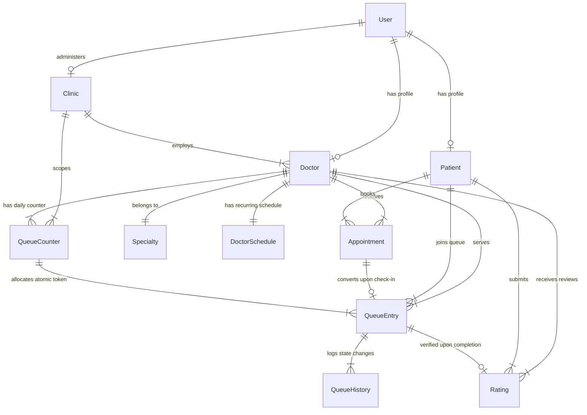

# QFlow Phase 02 — Schema Design

## 1. Schema Overview

Phase 02 establishes the foundational database design for QFlow using Mongoose and MongoDB. The system architecture enforces a clean separation of concerns across 11 core domain models:

1. **`User`**: Account authentication, credentials, and role authorization.
2. **`Patient`**: Patient-specific profile, demographic data, and contact preferences.
3. **`Doctor`**: Medical profile, qualifications, consultation fees, clinic assignments, and live operational status.
4. **`Clinic`**: Physical healthcare facility details, address, geospatial coordinates, and operational parameters.
5. **`Specialty`**: Medical taxonomy/category lookup entity (e.g., Cardiology, Neurology, Pediatrics).
6. **`Appointment`**: Planned future reservations for specific time windows (`BOOKED` state). Does **NOT** hold operational queue tokens.
7. **`QueueEntry`**: Active operational queue participation records for today's session. Holds allocated token numbers.
8. **`QueueCounter`**: Dedicated atomic sequence counter for allocating sequential, non-colliding token numbers per `{ clinicId, doctorId, date }`.
9. **`DoctorSchedule`**: Recurring weekly operational working hours, multi-shift configurations, and daily break/lunch periods.
10. **`QueueHistory`**: Append-only operational audit log tracking every state transition, staff action, and timestamp.
11. **`Rating`**: Verified post-consultation patient feedback tied exclusively to completed consultations.

---

## 2. User Model

### Purpose
The `User` model handles identity, authentication, credential storage, and role-based access control (RBAC). It decouples account credentials from domain-specific profiles (`Patient`, `Doctor`).

### Fields
| Field Name | Type | Required | Default / Enum | Description |
| :--- | :--- | :--- | :--- | :--- |
| `_id` | ObjectId | Auto | Auto | Unique user identity. |
| `email` | String | Yes | — | Unique email address (lowercase, trimmed). |
| `password` | String | Yes | — | Bcrypt hashed password. |
| `role` | String | Yes | `PATIENT`, `DOCTOR`, `STAFF`, `ADMIN` | Role enum. Self-registration defaults to `PATIENT`. |
| `isActive` | Boolean | Yes | `true` | Account active flag. |
| `createdAt` | Date | Auto | `Date.now` | Account creation timestamp. |
| `updatedAt` | Date | Auto | `Date.now` | Last update timestamp. |

### Relationships
- Referenced by `Patient.userId` (for patient accounts).
- Referenced by `Doctor.userId` (for doctor accounts).
- Referenced by `QueueHistory.changedBy` (for audit tracking).

### Constraints
- `email`: Must be unique, trimmed, lowercase, valid email format.
- `role`: Restricted to `['PATIENT', 'DOCTOR', 'STAFF', 'ADMIN']`.

### Indexes
- Unique index on `email` (`{ email: 1 }`).

---

## 3. Patient Model

### Purpose
Stores medical patient demographics, contact details, and location preferences without polluting the authentication `User` schema.

### Fields
| Field Name | Type | Required | Default / Enum | Description |
| :--- | :--- | :--- | :--- | :--- |
| `_id` | ObjectId | Auto | Auto | Unique patient profile ID. |
| `userId` | ObjectId | Optional | — | Reference to `User` account (Optional for walk-in patients created by staff). |
| `fullName` | String | Yes | — | Full name of patient. |
| `phone` | String | Yes | — | Mobile phone number (used by staff for quick walk-in search). |
| `gender` | String | Optional | `MALE`, `FEMALE`, `OTHER`, `PREFER_NOT_TO_SAY` | Gender demographic value. |
| `dateOfBirth` | Date | Optional | — | Date of birth for age calculation. |
| `address` | Object | Optional | — | Address object `{ street, city, state, pincode }`. |
| `location` | Object | Optional | `2dsphere` Point | `{ type: "Point", coordinates: [lng, lat] }` for patient location fallback. |
| `createdAt` | Date | Auto | `Date.now` | Creation timestamp. |
| `updatedAt` | Date | Auto | `Date.now` | Last update timestamp. |

### Relationships
- `userId` $\rightarrow$ References `User._id` (Optional).
- Referenced by `Appointment.patientId` and `QueueEntry.patientId`.

### Constraints
- `phone`: Required, trimmed, indexed for sub-second receptionist lookup.

### Indexes
- Index on `phone` (`{ phone: 1 }`).
- Index on `userId` (`{ userId: 1 }`).
- Geospatial 2dsphere index on `location` (`{ location: "2dsphere" }`).

---

## 4. Doctor Model

### Purpose
Represents a medical practitioner, storing clinical credentials, fees, ratings, clinic assignments, and real-time operational availability status.

### Fields
| Field Name | Type | Required | Default / Enum | Description |
| :--- | :--- | :--- | :--- | :--- |
| `_id` | ObjectId | Auto | Auto | Unique doctor ID. |
| `userId` | ObjectId | Yes | — | Reference to `User._id`. |
| `clinicId` | ObjectId | Yes | — | Primary `Clinic._id` assignment. |
| `specialtyId` | ObjectId | Yes | — | Reference to `Specialty._id`. |
| `fullName` | String | Yes | — | Doctor name with title (e.g., Dr. Ankit Sharma). |
| `gender` | String | Yes | `MALE`, `FEMALE`, `OTHER` | Doctor gender (used for optional patient filtering). |
| `qualifications` | [String] | Yes | — | Array of degrees (e.g., `["MD", "DM Cardiology"]`). |
| `experienceYears` | Number | Yes | `0` | Total years of medical practice. |
| `consultationFee` | Number | Yes | `0` | Consultation fee in currency units (INR). |
| `averageConsultationDurationMinutes` | Number | Yes | `15` | Default expected duration per patient (used for wait calculations). |
| `operationalStatus` | String | Yes | `AVAILABLE`, `BUSY`, `ON_BREAK`, `UNAVAILABLE`, `OFFLINE` | Live operational status (default: `AVAILABLE`). |
| `statusExpectedResumeTime` | Date | Optional | `null` | Target resume time when status is `BUSY` or `ON_BREAK`. |
| `averageRating` | Number | Yes | `0.0` | Denormalized average rating score (0.0 to 5.0). |
| `totalReviews` | Number | Yes | `0` | Denormalized total rating count. |
| `photoUrl` | String | Optional | `null` | Doctor profile image URL. |
| `createdAt` | Date | Auto | `Date.now` | Record creation timestamp. |
| `updatedAt` | Date | Auto | `Date.now` | Record update timestamp. |

### Relationships
- `userId` $\rightarrow$ `User._id`
- `clinicId` $\rightarrow$ `Clinic._id`
- `specialtyId` $\rightarrow$ `Specialty._id`
- Referenced by `DoctorSchedule`, `Appointment`, `QueueEntry`, `QueueCounter`, `Rating`.

### Constraints
- `operationalStatus` must be decoupled from `DoctorSchedule` (recurring weekly schedule).
- `averageRating` updated atomically upon rating completion.

### Indexes
- Index on `{ clinicId: 1, specialtyId: 1 }`.
- Index on `userId` (`{ userId: 1 }`).
- Index on `{ averageRating: -1, experienceYears: -1 }`.

---

## 5. Clinic Model

### Purpose
Represents the healthcare facility hosting doctor consultations and queue operations.

### Fields
| Field Name | Type | Required | Default / Enum | Description |
| :--- | :--- | :--- | :--- | :--- |
| `_id` | ObjectId | Auto | Auto | Unique clinic ID. |
| `name` | String | Yes | — | Facility name (e.g., City Heart Clinic). |
| `address` | Object | Yes | — | `{ street, city, state, pincode }`. |
| `location` | Object | Yes | `2dsphere` Point | `{ type: "Point", coordinates: [longitude, latitude] }`. |
| `phone` | String | Yes | — | Reception desk phone. |
| `email` | String | Optional | — | Contact email. |
| `adminId` | ObjectId | Yes | — | Reference to `User._id` (Clinic Admin). |
| `queuePolicy` | String | Yes | `HYBRID` | Clinic queue ordering policy enum (MVP: `HYBRID`). |
| `isActive` | Boolean | Yes | `true` | Active operational status. |
| `createdAt` | Date | Auto | `Date.now` | Creation timestamp. |
| `updatedAt` | Date | Auto | `Date.now` | Last update timestamp. |

### Relationships
- `adminId` $\rightarrow$ `User._id`
- Referenced by `Doctor`, `Appointment`, `QueueEntry`, `QueueCounter`.

### Constraints
- `location`: Must be a valid GeoJSON Point for geospatial distance calculations.

### Indexes
- Geospatial 2dsphere index on `location` (`{ location: "2dsphere" }`).
- Index on `adminId` (`{ adminId: 1 }`).

---

## 6. Specialty Model

### Purpose
Taxonomy entity for medical specialties/categories, enabling clean patient discovery and filtering without hard-coded string duplicates.

### Fields
| Field Name | Type | Required | Default / Enum | Description |
| :--- | :--- | :--- | :--- | :--- |
| `_id` | ObjectId | Auto | Auto | Unique specialty ID. |
| `name` | String | Yes | — | Specialty name (e.g., Cardiologist, Neurologist). |
| `code` | String | Yes | — | Normalized unique code (e.g., `CARDIOLOGY`, `NEUROLOGY`). |
| `description` | String | Optional | — | Brief category summary. |
| `iconName` | String | Optional | — | UI icon identifier. |
| `isActive` | Boolean | Yes | `true` | Category active status. |

### Relationships
- Referenced by `Doctor.specialtyId`.

### Constraints
- `name` and `code` must be unique and trimmed.

### Indexes
- Unique index on `code` (`{ code: 1 }`).

---

## 7. Appointment Model

### Purpose
Represents a planned reservation for a doctor on a specific date and time slot. **An appointment does NOT contain an operational queue token or occupy a live queue position.**

### Fields
| Field Name | Type | Required | Default / Enum | Description |
| :--- | :--- | :--- | :--- | :--- |
| `_id` | ObjectId | Auto | Auto | Unique appointment ID. |
| `clinicId` | ObjectId | Yes | — | Reference to `Clinic._id`. |
| `doctorId` | ObjectId | Yes | — | Reference to `Doctor._id`. |
| `patientId` | ObjectId | Yes | — | Reference to `Patient._id`. |
| `specialtyId` | ObjectId | Yes | — | Reference to `Specialty._id`. |
| `appointmentDate` | String | Yes | — | Date string formatted as `YYYY-MM-DD`. |
| `timeSlot` | Object | Yes | — | `{ startTime: "10:30", endTime: "10:45" }`. |
| `status` | String | Yes | `BOOKED`, `CHECKED_IN`, `CANCELLED`, `COMPLETED`, `NO_SHOW` | Booking status enum (default: `BOOKED`). |
| `cancellationReason` | String | Optional | `null` | Reason if cancelled. |
| `cancelledAt` | Date | Optional | `null` | Cancellation timestamp. |
| `checkedInAt` | Date | Optional | `null` | Timestamp when patient checked in at clinic. |
| `createdAt` | Date | Auto | `Date.now` | Booking timestamp. |
| `updatedAt` | Date | Auto | `Date.now` | Update timestamp. |

### States
- `BOOKED`: Created online; patient has reservation but no queue token yet.
- `CHECKED_IN`: Patient arrived at clinic; converted to active `QueueEntry`.
- `CANCELLED`: Appointment cancelled prior to consultation.
- `COMPLETED`: Consultation finished.
- `NO_SHOW`: Patient failed to check in for appointment.

### Constraints
- Must **NOT** store `tokenNumber`. Tokens are allocated ONLY upon check-in when `QueueEntry` is created.
- Double booking prevention: Compound unique index on active slots.

### Indexes
- Compound unique index on `{ doctorId: 1, appointmentDate: 1, "timeSlot.startTime": 1, status: 1 }`.
- Index on `{ patientId: 1, appointmentDate: -1 }`.

---

## 8. QueueEntry Model

### Purpose
Represents an active operational patient position in today's live clinic queue. Holds allocated token numbers.

### Fields
| Field Name | Type | Required | Default / Enum | Description |
| :--- | :--- | :--- | :--- | :--- |
| `_id` | ObjectId | Auto | Auto | Unique queue entry ID. |
| `clinicId` | ObjectId | Yes | — | Reference to `Clinic._id`. |
| `doctorId` | ObjectId | Yes | — | Reference to `Doctor._id`. |
| `patientId` | ObjectId | Yes | — | Reference to `Patient._id`. |
| `appointmentId` | ObjectId | Optional | `null` | Reference to `Appointment._id` (if source is `ONLINE`). |
| `queueDate` | String | Yes | — | Date string `YYYY-MM-DD`. |
| `tokenNumber` | Number | Yes | — | Sequential token allocated via `QueueCounter`. |
| `source` | String | Yes | `ONLINE`, `WALK_IN`, `STAFF_CREATED` | Queue entry source enum. |
| `priority` | String | Yes | `NORMAL`, `URGENT` | Entry priority level (default: `NORMAL`). |
| `status` | String | Yes | `WAITING`, `CALLED`, `IN_CONSULTATION`, `COMPLETED`, `SKIPPED`, `NO_SHOW`, `CANCELLED` | Live operational queue state (default: `WAITING`). |
| `joinedAt` | Date | Yes | `Date.now` | Check-in or walk-in registration timestamp. |
| `calledAt` | Date | Optional | `null` | Timestamp when staff clicked `Call Next`. |
| `consultationStartedAt` | Date | Optional | `null` | Timestamp when consultation started. |
| `completedAt` | Date | Optional | `null` | Timestamp when consultation completed. |
| `createdAt` | Date | Auto | `Date.now` | Record creation timestamp. |
| `updatedAt` | Date | Auto | `Date.now` | Record update timestamp. |

### States
- `WAITING`: Patient checked in or registered as walk-in; waiting in queue.
- `CALLED`: Patient called by receptionist/staff.
- `IN_CONSULTATION`: Patient inside consultation room with doctor.
- `COMPLETED`: Consultation finished.
- `SKIPPED`: Patient temporarily skipped by staff.
- `NO_SHOW`: Patient called but absent.
- `CANCELLED`: Token cancelled.

### Constraints
- `tokenNumber` must be allocated via `QueueCounter` atomically.
- Unique token constraint per doctor/date session.

### Indexes
- Compound unique index on `{ doctorId: 1, queueDate: 1, tokenNumber: 1 }`.
- Compound index on `{ doctorId: 1, queueDate: 1, status: 1, joinedAt: 1 }`.
- Index on `{ patientId: 1, queueDate: -1 }`.

---

## 9. QueueCounter Model

### Purpose
Dedicated atomic sequence counter responsible for safe token generation per `{ clinicId, doctorId, date }` scope, preventing duplicate tokens under concurrent staff actions.

### Fields
| Field Name | Type | Required | Default / Enum | Description |
| :--- | :--- | :--- | :--- | :--- |
| `_id` | ObjectId | Auto | Auto | Unique counter ID. |
| `clinicId` | ObjectId | Yes | — | Reference to `Clinic._id`. |
| `doctorId` | ObjectId | Yes | — | Reference to `Doctor._id`. |
| `date` | String | Yes | — | Session date formatted as `YYYY-MM-DD`. |
| `lastTokenNumber` | Number | Yes | `0` | Last allocated token number (incremented atomically via `$inc`). |
| `updatedAt` | Date | Auto | `Date.now` | Timestamp of last token allocation. |

### Atomicity Requirements
- Token increment MUST use `findOneAndUpdate` with `{ $inc: { lastTokenNumber: 1 } }, { new: true, upsert: true }`.
- Ensures zero token collisions during simultaneous walk-in submissions.

### Unique Constraints & Indexes
- Compound unique index on `{ clinicId: 1, doctorId: 1, date: 1 }`.

---

## 10. DoctorSchedule Model

### Purpose
Defines recurring weekly working hours, multi-shift intervals, and scheduled break periods for a doctor.

### Fields
| Field Name | Type | Required | Default / Enum | Description |
| :--- | :--- | :--- | :--- | :--- |
| `_id` | ObjectId | Auto | Auto | Unique schedule ID. |
| `doctorId` | ObjectId | Yes | — | Reference to `Doctor._id`. |
| `clinicId` | ObjectId | Yes | — | Reference to `Clinic._id`. |
| `weeklyHours` | Array | Yes | — | Array of daily shift objects for 7 days (Monday–Sunday). |
| `effectiveFrom` | Date | Yes | `Date.now` | Effective start date of schedule. |
| `isActive` | Boolean | Yes | `true` | Active schedule flag. |

### Schedule Structure (`weeklyHours` element schema)
```json
{
  "dayOfWeek": "MONDAY",
  "isWorkingDay": true,
  "shifts": [
    { "startTime": "09:00", "endTime": "13:00" },
    { "startTime": "14:00", "endTime": "18:00" }
  ],
  "breaks": [
    { "startTime": "13:00", "endTime": "14:00", "label": "Lunch Break" }
  ]
}
```

### Constraints
- Decoupled from `Doctor.operationalStatus` (temporary status overrides).
- Unique index on `{ doctorId: 1, clinicId: 1, isActive: 1 }`.

---

## 11. QueueHistory Model

### Purpose
Append-only operational audit log recording state transitions, staff actions, and doctor status changes for analytics, compliance, and dispute resolution.

### Fields
| Field Name | Type | Required | Default / Enum | Description |
| :--- | :--- | :--- | :--- | :--- |
| `_id` | ObjectId | Auto | Auto | Unique audit log ID. |
| `queueEntryId` | ObjectId | Optional | `null` | Reference to `QueueEntry._id` (if transition relates to a queue entry). |
| `doctorId` | ObjectId | Yes | — | Reference to `Doctor._id`. |
| `clinicId` | ObjectId | Yes | — | Reference to `Clinic._id`. |
| `action` | String | Yes | — | Action enum (e.g., `CALL_NEXT`, `START_CONSULTATION`, `COMPLETE`, `SKIP`, `NO_SHOW`, `REJOIN`, `PAUSE_QUEUE`, `RESUME_QUEUE`, `STATUS_CHANGE`). |
| `previousState` | String | Optional | `null` | Previous state value. |
| `newState` | String | Yes | — | New state value. |
| `performedBy` | ObjectId | Yes | — | Reference to `User._id` (staff, doctor, patient, or system). |
| `userRole` | String | Yes | — | Role of performing user (`STAFF`, `DOCTOR`, `PATIENT`, `ADMIN`). |
| `reason` | String | Optional | `null` | Optional reason/notes. |
| `timestamp` | Date | Yes | `Date.now` | Exact event timestamp. |

### Constraints
- Append-only collection; no update or deletion endpoints allowed.

### Indexes
- Index on `{ doctorId: 1, timestamp: -1 }`.
- Index on `{ queueEntryId: 1, timestamp: 1 }`.

---

## 12. Rating Model

### Purpose
Stores post-consultation ratings and reviews submitted by patients for verified completed consultations.

### Fields
| Field Name | Type | Required | Default / Enum | Description |
| :--- | :--- | :--- | :--- | :--- |
| `_id` | ObjectId | Auto | Auto | Unique rating ID. |
| `queueEntryId` | ObjectId | Yes | — | Reference to `QueueEntry._id` (must have status `COMPLETED`). |
| `appointmentId` | ObjectId | Optional | `null` | Reference to `Appointment._id`. |
| `doctorId` | ObjectId | Yes | — | Reference to `Doctor._id`. |
| `patientId` | ObjectId | Yes | — | Reference to `Patient._id`. |
| `rating` | Number | Yes | — | Integer score (1 to 5 stars). |
| `reviewText` | String | Optional | `null` | Optional text feedback. |
| `createdAt` | Date | Auto | `Date.now` | Rating submission timestamp. |

### Verification Rules & Constraints
- Rating submission allowed ONLY if `QueueEntry.status === 'COMPLETED'`.
- Strict 1 rating per completed consultation: Compound unique index on `{ queueEntryId: 1 }`.

### Indexes
- Compound unique index on `{ queueEntryId: 1 }`.
- Index on `{ doctorId: 1, createdAt: -1 }`.

---

## 13. Entity Relationship Diagram



---

## 14. Important Business Invariants

The Phase 02 schema design guarantees the following non-negotiable invariants:

1. **Appointment $\neq$ QueueEntry:** An `Appointment` is a planned reservation (`BOOKED`). It does NOT allocate a queue token or occupy a position in the live queue until clinic check-in.
2. **Atomic Token Allocation:** Operational token numbers are generated exclusively via `QueueCounter.findOneAndUpdate` with `$inc` scoped to `{ clinicId, doctorId, date }`. Duplicate tokens under concurrent staff actions are impossible.
3. **Decoupled Schedule vs. Operational Status:** `DoctorSchedule` stores recurring weekly working hours and break templates. `Doctor.operationalStatus` stores daily live status overrides (`AVAILABLE`, `BUSY`, `ON_BREAK`, `UNAVAILABLE`, `OFFLINE`). Unplanned delays never modify the weekly template.
4. **Deterministic Hybrid Queue Ordering:** The hybrid engine calculates operational ordering based on check-in time, appointment target window, doctor breaks, and current status. Actively waiting patients are protected against arbitrary reordering.
5. **Verified Rating Restriction:** Ratings require a completed `QueueEntry` (`status === 'COMPLETED'`) and are constrained to 1 rating per completed entry via a unique index on `queueEntryId`.
6. **Append-Only Operational Audit:** All state transitions and administrative queue overrides are recorded in `QueueHistory` without mutating past audit records.

---

## 15. Normalization Review

| Data Element | Design Strategy | Justification |
| :--- | :--- | :--- |
| **Doctor `averageRating` & `totalReviews`** | Denormalized on `Doctor` model | Avoids running expensive `$aggregate` queries on the `Rating` collection during high-volume doctor discovery list queries. Updated atomically upon rating creation. |
| **Live Queue Position** | Computed dynamically at runtime | Persisting static queue positions (e.g. "Position #3") causes cascading database writes whenever a patient cancels or is skipped. Queue position is derived dynamically from `QueueEntry` status and `joinedAt`/`tokenNumber`. |
| **Estimated Wait Time** | Computed dynamically at runtime | Wait time range is calculated dynamically during polling queries using active waiting count, remaining consultation time, and planned breaks. |
| **Patient Demographics** | Separated into `Patient` model | Keeps `User` authentication schema lightweight and allows staff to create walk-in patient profiles without requiring immediate user account credentials. |

---

## 16. Concurrency Considerations

1. **Simultaneous Walk-in Creation:** Receptionist A and B submitting walk-in registrations simultaneously execute atomic `$inc` on `QueueCounter`. Mongo guarantees sequential token assignment (#35 and #36) without collisions.
2. **Duplicate Appointment Prevention:** Compound unique index on `{ doctorId, appointmentDate, "timeSlot.startTime", status: { $ne: 'CANCELLED' } }` rejects concurrent double-booking requests.
3. **Idempotent Queue State Actions:** Controller endpoints check current `QueueEntry.status` before transitioning. If `Call Next` is double-clicked, the second request safely returns current `CALLED` state.
4. **Verified Rating Prevention:** Unique index on `{ queueEntryId: 1 }` prevents double-submission of reviews.

---

## 17. Open Questions

No unresolved schema questions.

---

## 18. Phase 02 Implementation Readiness

### **READY FOR MODEL IMPLEMENTATION**

---
*Schema design audit completed for QFlow Phase 02 database specification.*
